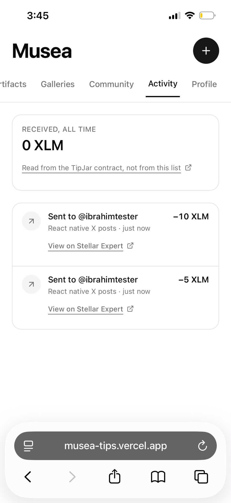
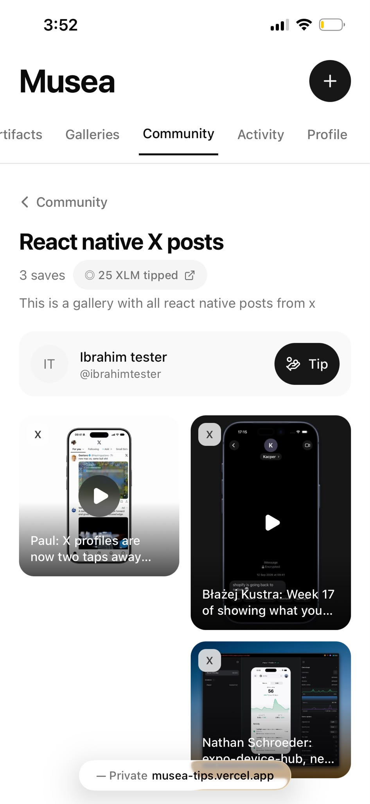
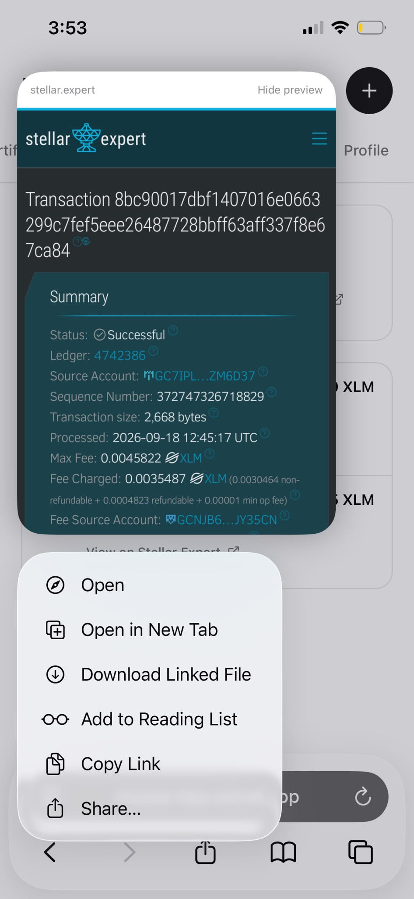
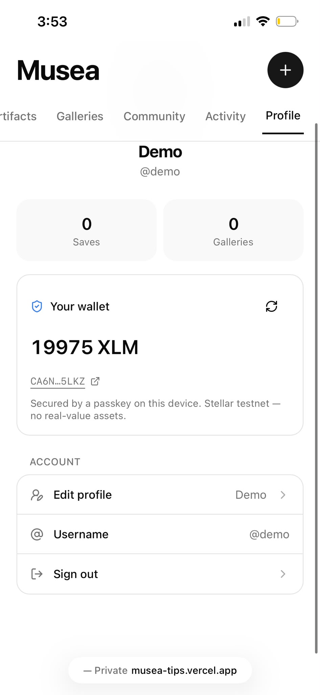

# Evidence bundle — Musea Curator Tips

Everything this Instaward is assessed on, in one place, with a link for each claim.

You don't need to set anything up to check this. Every link opens in a browser and resolves
against live Stellar testnet data. Where a claim can be re-derived instead of trusted, the
command that re-derives it is printed underneath.

| | |
|---|---|
| Network | Stellar testnet. No real value moves, and mainnet is out of scope |
| Asset | XLM, the network's native asset |
| Compiled | 2026-09-18, against ledger 4,742,530 |
| Repository | MIT. Contract source, backend, web app and these docs |

Every total below was read back from the deployed contract's own storage through Stellar
RPC on the compile date, and every transaction was confirmed against Horizon. Where a
number also appears in Musea's database, it is shown separately and labelled, so the two
can be compared instead of conflated.

One warning. Stellar testnet is wiped roughly every quarter, and when that happens every
address and hash on this page stops resolving at once. That's testnet, not the work. Re-run
`scripts/setup-testnet.sh`, update the Convex environment variables, and regenerate this
file. Check the links resolve on the day you submit.

---

## Contents

- [Deliverable 1 — Soroban TipJar contract](#deliverable-1--soroban-tipjar-contract)
- [Deliverable 2 — Passkey smart wallet and one-tap tip](#deliverable-2--passkey-smart-wallet-and-one-tap-tip)
- [Deliverable 3 — Receipts, on-chain totals, docs](#deliverable-3--receipts-on-chain-totals-docs)
- [Submission cleanup](#submission-cleanup)
- [Still outstanding](#still-outstanding)

---

# Deliverable 1 — Soroban TipJar contract

## 1.1 Deployed addresses

| What | Address | Verify |
|---|---|---|
| TipJar contract | `CCZPKSRPIFDHH4L33WQS3JF2GS5OS4FASCDXHSNGDRDCDTZXFB7DPZAP` | [Stellar Expert](https://stellar.expert/explorer/testnet/contract/CCZPKSRPIFDHH4L33WQS3JF2GS5OS4FASCDXHSNGDRDCDTZXFB7DPZAP) |
| Native XLM Stellar Asset Contract, the token TipJar moves | `CDLZFC3SYJYDZT7K67VZ75HPJVIEUVNIXF47ZG2FB2RMQQVU2HHGCYSC` | [Stellar Expert](https://stellar.expert/explorer/testnet/contract/CDLZFC3SYJYDZT7K67VZ75HPJVIEUVNIXF47ZG2FB2RMQQVU2HHGCYSC) |

Source is [`contracts/tipjar/src/lib.rs`](../contracts/tipjar/src/lib.rs); the full
interface is in [`contract-reference.md`](./contract-reference.md).

### Checking the token binding

Calling `token()` on the deployed TipJar returns the native XLM SAC above. The contract
stores its token at construction and never accepts one as a call parameter, so a caller
can't attribute a tip paid in some worthless token they minted themselves.

```bash
stellar contract invoke --id CCZPKSRPIFDHH4L33WQS3JF2GS5OS4FASCDXHSNGDRDCDTZXFB7DPZAP \
  --source <any funded testnet account> --network testnet --send=no -- token
# → "CDLZFC3SYJYDZT7K67VZ75HPJVIEUVNIXF47ZG2FB2RMQQVU2HHGCYSC"
```

Verified live on 2026-09-18.

## 1.2 Sample manual tip

The first `tip` invocation, made from the command line before any wallet layer existed.
That's what makes Deliverable 1 provable on its own.

| | |
|---|---|
| Transaction | [`762d5d84fda1eafc17179c2c2f58feeb212363aec3a8770adf885d395b7362a3`](https://stellar.expert/explorer/testnet/tx/762d5d84fda1eafc17179c2c2f58feeb212363aec3a8770adf885d395b7362a3) |
| Ledger | 4,676,946, closed 2026-09-14 17:51:57 UTC |
| Source | `GAX33TLICSHQCI3BHAKHPGOZZYWKWR6MYLYECJ5Y7JTPIFELZLSJQBNC` |
| Amount | 1.0000000 XLM |
| Result | successful |

A second CLI tip 20 seconds later,
[`d0eb9b53…`](https://stellar.expert/explorer/testnet/tx/d0eb9b53046c09120285ebf50c1c6b7184a3673570ef83b3198eea70b7001a28)
in ledger 4,676,950, paid a recipient that had never held the asset and needed no opt-in.

## 1.3 gallery_total and curator_total update correctly

This is what the contract exists to do, so it's shown as arithmetic you can check rather
than as a screenshot. The left column is live contract state; the right column lists every
transaction that contributed to it. They agree in every case.

### gallery_total(gallery_id)

| Gallery key, `sha256(galleryId)` | On-chain total | The tips that produced it |
|---|---|---|
| `ca32c770…c98e` | 10.0000000 XLM | [`182571fe…`](https://stellar.expert/explorer/testnet/tx/182571fe0f7c0c32b4abaee48df75f615974c0a6cdff31ff4aec1fc43baab6ab) 5 XLM + [`c5ea7c1c…`](https://stellar.expert/explorer/testnet/tx/c5ea7c1c6f81b0ec029d1b97f1a27fd8ba5cc37bc91afffa443e67e3721721c9) 5 XLM |
| `5dc2d082…66dd` | 25.0000000 XLM | [`22ca20d0…`](https://stellar.expert/explorer/testnet/tx/22ca20d0e4223313a74eb62455d0996ad5cc9bacbb81e7d9bf42f3abb8dce194) 5 + [`37417fbc…`](https://stellar.expert/explorer/testnet/tx/37417fbc50a9f75d9d22b0d3bbde99ea1e1c2c2eecaa0b19cf15df1e06626e85) 5 + [`ba0974a5…`](https://stellar.expert/explorer/testnet/tx/ba0974a5c650e30f5ceac0915b7cc67e18226e8cdff3be4a69685bf6b4b88de1) 5 + [`8bc90017…`](https://stellar.expert/explorer/testnet/tx/8bc90017dbf1407016e0663299c7fef5eee26487728bbff63aff337f8e67ca84) 10 XLM |
| `4d5c4a49…47cf` | 1.0000000 XLM | [`bfe4f8ff…`](https://stellar.expert/explorer/testnet/tx/bfe4f8ff29746e332ed1225720cf6b3184eb27c2296d406a7799ec8c0366e3a3) 1 XLM |
| `d492adaa…2cbd` | 31.0000000 XLM | five CLI rehearsal tips: 10 + 5 + 10 + 5 + 1 XLM |

### curator_total(address)

| Curator's smart account | On-chain total | Received from |
|---|---|---|
| [`CAR7AU4R…SV6H`](https://stellar.expert/explorer/testnet/contract/CAR7AU4RO6DQKLMM6RT5FZXJJ7BW35RGEVCFAINHSZ4RNKJAXJGMSV6H) | 10.0000000 XLM | `182571fe…` + `c5ea7c1c…` |
| [`CDQU67BA…ETQN`](https://stellar.expert/explorer/testnet/contract/CDQU67BAV4NHJTMWTBJLDNEHF3HEJYSMSIYCDMNNIJWRWL56WEO2ETQN) | 25.0000000 XLM | `22ca20d0…` + `37417fbc…` + `ba0974a5…` + `8bc90017…` |
| [`CDBXYWOG…R7S3`](https://stellar.expert/explorer/testnet/contract/CDBXYWOGZVV6QPDIZB45OHZIW2766QAHNOGRRZNOWC5TL246JUUHR7S3) | 1.0000000 XLM | `bfe4f8ff…` |

`ca32c770…` and `CAR7AU4R…` both read 10 XLM because the same two tips incremented a
gallery key and a curator key. A bug in either path would show up as a disagreement between
these two tables, and there isn't one.

The contract also moves the money before it writes anything. If the SAC transfer traps, the
whole invocation reverts and no total is recorded, so a total can never describe a transfer
that didn't happen. The test `failed_transfer_records_no_total` covers that ordering.

### Reproducing these numbers

```bash
# gallery_total for one gallery key
stellar contract invoke --id CCZPKSRPIFDHH4L33WQS3JF2GS5OS4FASCDXHSNGDRDCDTZXFB7DPZAP \
  --source <any funded testnet account> --network testnet --send=no \
  -- gallery_total --gallery ca32c7705de03b51fb241509bb18774a160bc89cbc9be740ae50b82ecfb7c98e

# curator_total for one curator
stellar contract invoke --id CCZPKSRPIFDHH4L33WQS3JF2GS5OS4FASCDXHSNGDRDCDTZXFB7DPZAP \
  --source <any funded testnet account> --network testnet --send=no \
  -- curator_total --curator CAR7AU4RO6DQKLMM6RT5FZXJJ7BW35RGEVCFAINHSZ4RNKJAXJGMSV6H
```

Values come back in stroops (1 XLM = 10,000,000 stroops), so 10 XLM reads as `100000000`.

Note that contract state persists and can be read at any time, but Stellar RPC only keeps
about a week of contract events. That's why the transaction hashes are written down here.

## 1.4 Test suite, lints and formatting

Run on 2026-09-18 against `contracts/tipjar`. Reproduce with
`turbo run test --filter=@musea/tipjar`, or directly:

### cargo test

```
$ cargo test --manifest-path contracts/tipjar/Cargo.toml

    Finished `test` profile [unoptimized + debuginfo] target(s) in 0.52s
     Running unittests src\lib.rs (target\debug\deps\tipjar-67d37f453e30aa90.exe)

running 10 tests
test test::token_address_is_fixed_at_construction ... ok
test test::unknown_gallery_reads_zero ... ok
test test::failed_transfer_records_no_total ... ok
test test::rejects_self_tip ... ok
test test::rejects_zero_and_negative_amounts ... ok
test test::tip_moves_xlm_and_records_totals ... ok
test test::totals_are_scoped_per_gallery ... ok
test test::emits_tip_event ... ok
test test::tip_requires_tipper_auth ... ok
test test::totals_accumulate_across_tips_and_tippers ... ok

test result: ok. 10 passed; 0 failed; 0 ignored; 0 measured; 0 filtered out; finished in 0.04s
```

Each test name is a claim about the contract that anyone can re-run. Source:
[`contracts/tipjar/src/test.rs`](../contracts/tipjar/src/test.rs).

`tip_requires_tipper_auth` was checked by deleting the `require_auth` call and confirming
the test then fails. A test that still passes against a contract with no authorization at
all isn't proving anything.

### cargo clippy

```
$ cargo clippy --all-targets -- -D warnings

    Checking tipjar v0.1.0 (contracts/tipjar)
    Finished `dev` profile [unoptimized + debuginfo] target(s) in 2.24s
```

Clean. With `-D warnings`, any lint at all would have failed the command.

### cargo fmt

```
$ cargo fmt --all -- --check

(no output, exit code 0)
```

Clean. `--check` prints a diff and exits non-zero if anything is misformatted, so silence
is the pass condition.

---

# Deliverable 2 — Passkey smart wallet and one-tap tip

## 2.1 The deployed app

| | |
|---|---|
| Live URL | https://musea-tips.vercel.app |
| Commit deployed | `0674d8c6d0fb66513150f85095c3b4ecde42e70f` |
| This exact build, permanently | https://musea-tips-h8dy5kbcr-ibonajjars-projects.vercel.app |
| Built | 2026-09-16 01:22:46 UTC, from branch `main` |
| Host | Vercel |
| Backend | Convex deployment `zealous-stork-862` |

That commit is the tip of `main` and is what the live site was built from. The deployment
URL in the third row is immutable: Vercel pins it to this one build forever, so it stays
verifiable even after later deploys move the `musea-tips.vercel.app` alias on.

Anyone can confirm the pairing:

```bash
vercel inspect musea-tips.vercel.app          # deployment id and status
gh api repos/<owner>/<repo>/commits/0674d8c   # the commit itself
```

The documentation in this `docs/` folder was added on top of that commit and doesn't change
application behaviour, so what a reviewer opens at the live URL is the code at the SHA
above.

The WebAuthn Relying Party ID is `musea-tips.vercel.app`, and that matters for anyone
testing. A passkey is bound to the exact domain that created it, so a credential made on
`localhost` or on a per-branch Vercel preview URL will not resolve on the production
domain. Test on the URL above and sign up there; an account made anywhere else won't carry
over.

## 2.2 Screen recording

[**`demo1.mp4`**](./demo1.mp4), in this folder. One continuous run on a real iPhone in
Safari: passkey sign-in, smart account creation, wallet funding, sending a tip, the receipt
and its transaction hash, and the gallery total going up.

| | |
|---|---|
| File | [`docs/demo1.mp4`](./demo1.mp4) |
| Length | 1 minute 28 seconds |
| Format | MP4, 384x832 portrait, 6.9 MB |
| Device | Real iPhone, Safari |

iPhone Safari is the only verification target for this project, so that's the only
recording needed.

What the recording covers, in the order the acceptance criteria ask for:

1. Signed-out state on `musea-tips.vercel.app`. Tap Sign in, then Face ID.
2. Profile: the wallet card provisioning, showing the `C…` smart account address appearing
   and then its funded XLM balance.
3. A gallery page with its on-chain total tipped visible before the tip.
4. Tap Tip, then the amount sheet, then 5 XLM, then Confirm, then the Face ID prompt.
5. The success toast, and the balance chip going down.
6. The same gallery total, now higher by exactly 5 XLM.
7. `/app/activity`, the new receipt row, then tap through to Stellar Expert.
8. Stellar Expert showing the transaction: amount, sender, recipient, and the fee account.
   That last one is the gasless proof, since the fee account isn't the sender.

The transaction hash shown in the recording can be checked against the tables in sections
2.3 and 2.4, and against Stellar Expert directly. Stills from the same session are in
[section 2.7](#27-screenshots-from-iphone-safari).

## 2.3 The headline transaction

A 5 XLM tip authorized by Face ID on a physical iPhone in Safari, signed by a secp256r1 key
generated in the device's Secure Enclave, and submitted through the OpenZeppelin Relayer so
the user paid no fee and holds no classic Stellar account.

| | |
|---|---|
| Transaction | [`182571fe0f7c0c32b4abaee48df75f615974c0a6cdff31ff4aec1fc43baab6ab`](https://stellar.expert/explorer/testnet/tx/182571fe0f7c0c32b4abaee48df75f615974c0a6cdff31ff4aec1fc43baab6ab) |
| From, the tipper's smart account | [`CATDEQEYIHCUPVEWVGDHDV2KXMUN4YLEJEJUX2XS4NBNDTLHRXF3IK57`](https://stellar.expert/explorer/testnet/contract/CATDEQEYIHCUPVEWVGDHDV2KXMUN4YLEJEJUX2XS4NBNDTLHRXF3IK57) |
| To, the curator's smart account | [`CAR7AU4RO6DQKLMM6RT5FZXJJ7BW35RGEVCFAINHSZ4RNKJAXJGMSV6H`](https://stellar.expert/explorer/testnet/contract/CAR7AU4RO6DQKLMM6RT5FZXJJ7BW35RGEVCFAINHSZ4RNKJAXJGMSV6H) |
| Amount | 5.0000000 XLM |
| Ledger | 4,699,546, closed 2026-09-16 00:15:32 UTC |
| Result | successful |

Both ends are `C…` contracts. Neither party has a classic Stellar account, a seed phrase,
or an installed wallet extension, which is the point of the wallet model in section 4.2 of
the SOW.

### The gasless claim, from the ledger

Horizon reports three different accounts on that transaction:

| Field | Value | What it means |
|---|---|---|
| Tipper | `CATDEQEY…IK57` | A contract. It can't be a transaction source or pay a fee |
| `source_account` | `GCDKGBSZ5LWV4CFP2KFFIXQ3OPUZKFDRXXNR6KRFRC2R3IS3LLYZUF3J` | A relayer channel account, supplying the sequence number |
| `fee_account` | `GCNJB6V5YIODDSSCWXZ2VOKMRPRVZ2V723RRQS6STXE6NWTGVOJY35CN` | Who actually paid: the OpenZeppelin Channels fee sponsor |
| `fee_charged` | 360,639 stroops (0.0360639 XLM) | Paid by the sponsor, not the tipper |

The same `fee_account` shows up on every passkey tip below, while `source_account` is
different on each one. That's what a channel-account relayer looks like from the outside.
Check it yourself:

```bash
curl -s https://horizon-testnet.stellar.org/transactions/182571fe0f7c0c32b4abaee48df75f615974c0a6cdff31ff4aec1fc43baab6ab \
  | jq '{source_account, fee_account, fee_charged, successful}'
```

## 2.4 Every passkey-signed tip

Seven smart-account-to-smart-account tips, so the path is repeatable and not a one-off. All
seven were authorized by a WebAuthn assertion from a device passkey, submitted gaslessly,
and confirmed successfully. The top two are from the demo recorded on 2026-09-18.

| When (UTC) | Transaction | Amount | From (`C…`) | To (`C…`) | Fee paid by |
|---|---|---|---|---|---|
| 09-18 12:45:17 | [`8bc90017…`](https://stellar.expert/explorer/testnet/tx/8bc90017dbf1407016e0663299c7fef5eee26487728bbff63aff337f8e67ca84) | 10 XLM | `CA6NNHTH…` | `CDQU67BA…` | `GCNJB6V5…` |
| 09-18 12:39:22 | [`ba0974a5…`](https://stellar.expert/explorer/testnet/tx/ba0974a5c650e30f5ceac0915b7cc67e18226e8cdff3be4a69685bf6b4b88de1) | 5 XLM | `CA6NNHTH…` | `CDQU67BA…` | `GCNJB6V5…` |
| 09-16 15:25:47 | [`37417fbc…`](https://stellar.expert/explorer/testnet/tx/37417fbc50a9f75d9d22b0d3bbde99ea1e1c2c2eecaa0b19cf15df1e06626e85) | 5 XLM | `CAEMDZW2…` | `CDQU67BA…` | `GCNJB6V5…` |
| 09-16 14:49:22 | [`bfe4f8ff…`](https://stellar.expert/explorer/testnet/tx/bfe4f8ff29746e332ed1225720cf6b3184eb27c2296d406a7799ec8c0366e3a3) | 1 XLM | `CDTEXHIA…` | `CDBXYWOG…` | `GCNJB6V5…` |
| 09-16 08:14:47 | [`22ca20d0…`](https://stellar.expert/explorer/testnet/tx/22ca20d0e4223313a74eb62455d0996ad5cc9bacbb81e7d9bf42f3abb8dce194) | 5 XLM | `CB66DUBB…` | `CDQU67BA…` | `GCNJB6V5…` |
| 09-16 00:43:42 | [`c5ea7c1c…`](https://stellar.expert/explorer/testnet/tx/c5ea7c1c6f81b0ec029d1b97f1a27fd8ba5cc37bc91afffa443e67e3721721c9) | 5 XLM | `CD7GAERB…` | `CAR7AU4R…` | `GCNJB6V5…` |
| 09-16 00:15:32 | [`182571fe…`](https://stellar.expert/explorer/testnet/tx/182571fe0f7c0c32b4abaee48df75f615974c0a6cdff31ff4aec1fc43baab6ab) | 5 XLM | `CATDEQEY…` | `CAR7AU4R…` | `GCNJB6V5…` |

Earlier tips on this contract came from classic `G…` accounts, sent by the CLI and the
developer harness before the wallet layer existed. The contract's `require_auth` doesn't
distinguish between the two kinds of caller, which is why Deliverable 1 could be proven
first and on its own. Those are the rehearsal rows in the `d492adaa…` gallery total above.

## 2.5 The wallet infrastructure

| What | Value |
|---|---|
| Smart account WASM hash | `1b5f4534a76322da2ad7c745f6900857a6802b0ca79850c35a03561df997785a` |
| On-chain WebAuthn verifier | [`CC7EKIHQP3TN4CARQDND6CEOY2UXLWWC2X5GHTD5NLAT7BG5GPZIOM3F`](https://stellar.expert/explorer/testnet/contract/CC7EKIHQP3TN4CARQDND6CEOY2UXLWWC2X5GHTD5NLAT7BG5GPZIOM3F) |
| Relayer | OpenZeppelin Channels, `https://channels.openzeppelin.com/testnet` |

Neither contract is ours. Both are published deployments of the Smart Account Kit's own
contracts, and a smart account's address is derived from them, so they're treated as
append-only: changing either one orphans every account already created.

Each account's deployment is on-chain and recorded per user, so an account's origin can be
verified rather than assumed. Smart account
`CAEMDZW2EATLL6KXPHPCXLJX2DKVSIBW7XNEZO36MCMMCYCKX32FEKGT`, for example, was created by
transaction
[`c6f8d4b3…`](https://stellar.expert/explorer/testnet/tx/c6f8d4b3f426684cf78d592c39071176fcf3db6f47303cd416a1e65472cd906c)
in ledger 4,709,712.

## 2.6 The tip is recorded in Convex and shows in Activity

The chain is the source of truth and Musea's database is the receipt book. Both exist, and
they agree.

Read from the live Convex deployment on 2026-09-18 with `npx convex data tips`, with the
bulky transient columns left out:

| Convex `_id` | status | amountStroops | txHash | galleryHashHex |
|---|---|---|---|---|
| `jh788axsmgvyrb96wz67szycdx8em1tk` | `success` | `100000000` | `8bc90017…7ca84` | `5dc2d082…66dd` |
| `jh71pszwcjahtwgt3sd4fhxh8x8enept` | `success` | `50000000` | `ba0974a5…8de1` | `5dc2d082…66dd` |
| `jh7870m1y2q14f1jfcbkprz14h8ehwzc` | `success` | `50000000` | `37417fbc…6e85` | `5dc2d082…66dd` |
| `jh7ds9b320r7a1v0m8phtbdrdh8egnxe` | `success` | `10000000` | `bfe4f8ff…e3a3` | `4d5c4a49…47cf` |
| `jh76jsdkg6w2wd1zp9ef5z73vx8egcwy` | `success` | `50000000` | `22ca20d0…e194` | `5dc2d082…66dd` |
| `jh73fh0cvnat0fazsttmfkhct18eg8xk` | `success` | `50000000` | `c5ea7c1c…21c9` | `ca32c770…c98e` |
| `jh7eeqx9vfd8jd7j286kea7at58eh9hs` | `success` | `50000000` | `182571fe…b6ab` | `ca32c770…c98e` |

Every `txHash` there is one of the transactions in section 2.4, and every
`galleryHashHex` is one of the gallery keys whose on-chain total appears in section 1.3.
The database rows, the ledger and the contract's storage all describe the same tips.

The Activity page renders direction, gallery title, counterparty, amount, status, timestamp
and a tap-to-verify link to Stellar Expert built from `txHash`. Source:
[`convex/tips.ts`](../packages/backend/convex/tips.ts) and
[`activity-view.tsx`](../apps/web/components/musea/activity-view.tsx).

Three things about that page are worth a reviewer's attention:

- The headline number doesn't come from the database. "Received, all time" calls
  `curator_total` on the contract, while the list underneath it is database-sourced. They
  sit side by side on purpose, so a divergence would be visible instead of hidden.
- `listMyTips` takes no `userId`. The caller is whoever the session says they are, so one
  curator can't read another's tip history by guessing an id.
- Raw error text never reaches the browser. Rows are projected field by field, and the
  `errorDetail` column stays server-side.

The table also holds rows with `status: "failed"` and `errorCode: "SIGNATURE_REJECTED"`,
where someone dismissed the Face ID sheet. Nothing was built, signed or submitted, so they
are filtered out of the feed instead of shown as failures. Real failures are kept.

## 2.7 Screenshots from iPhone Safari

All four taken on a physical iPhone in Safari on 2026-09-18, during the same session as the
recording. The URL bar reads `musea-tips.vercel.app` in every one, which is also the
WebAuthn Relying Party ID the passkeys are bound to. Two were taken in a Private window,
where Safari's storage rules are harsher and passkeys are the stricter test.

### The Activity page



"Received, all time" reads 0 XLM and says underneath it, in the app itself, *"Read from the
TipJar contract, not from this list."* Zero is the correct answer here: this account has
only ever sent. Below it are two settled tips, `-10 XLM` and `-5 XLM` to @ibrahimtester on
the "React native X posts" gallery, each with its own **View on Stellar Expert** link.

Those two rows are the transactions `8bc90017…` and `ba0974a5…` in section 2.4.

### A gallery with its on-chain total



The "React native X posts" gallery, showing **25 XLM tipped** next to its save count, with
a link out to the contract. That badge is `gallery_total` read from contract state, and
`gallery_total(5dc2d082…)` returns exactly 25.0000000 XLM, as section 1.3 shows. The
curator's Tip button sits directly below it.

### A receipt link resolving to Stellar Expert



A **View on Stellar Expert** link from the Activity page, previewed in Safari. Everything
visible in it was confirmed against Horizon:

| Shown on the phone | Confirmed |
|---|---|
| Transaction `8bc90017dbf1407016e0663299c7fef5eee26487728bbff63aff337f8e67ca84` | matches section 2.4 |
| Status: Successful, ledger 4742386 | `successful: true`, ledger 4,742,386 |
| Processed 2026-09-18 12:45:17 UTC | same |
| Source Account `GC7IPL…ZM6D37` | `GC7IPLMJSEK4KFYBS7B2UQIEIZUO7ZS4ATIEZFRV5D4TY3VZQIZM6D37` |
| Fee Charged 0.0035487 XLM | 35,487 stroops |
| **Fee Source Account `GCNJB6…JY35CN`** | `GCNJB6V5YIODDSSCWXZ2VOKMRPRVZ2V723RRQS6STXE6NWTGVOJY35CN` |

That last row is the gasless proof in a single frame: the account paying the fee is the
relayer's sponsor, not the tipper, and not the transaction source either.

### The wallet on the Profile page



The `@demo` account holding **19975 XLM** in smart account `CA6N…5LKZ`, captioned by the
app as *"Secured by a passkey on this device. Stellar testnet — no real-value assets."*

The full address is `CA6NNHTHCXEMAT5VQ5WCSZJSJBGBSMEK7IHF7VZTNOXZQNG52ZRB5LKZ`, which is
the sender on both 2026-09-18 tips in section 2.4. The balance reconciles too: the account
was funded with 20,000 test XLM and has sent 25, and 20,000 − 25 = 19,975. The user paid no
fees, which is why the balance is down by the tip amounts exactly and nothing more.

There is no seed phrase on this screen and no way to export a key, because there is no key
to export. See section 3.3.

---

# Deliverable 3 — Receipts, on-chain totals, docs

| Evidence asked for | State |
|---|---|
| Wallet / Activity screen with live receipt links | Built, at `/app/activity`. Every settled row links to its transaction on Stellar Expert. Evidence in section 2.6 |
| A gallery showing its on-chain total tipped | Built. Read from `gallery_total` contract state and linked to the contract. Evidence in section 1.3 |
| Public repo, MIT licensed | [`LICENSE`](../LICENSE) |
| README and developer docs | [`README.md`](../README.md), [`architecture.md`](./architecture.md), [`contract-reference.md`](./contract-reference.md), [`tip-flow.md`](./tip-flow.md), and this file |
| iPhone Safari screenshots of Activity | Captured. Four screenshots in section 2.7, including the Activity page and a receipt link resolving on the phone |
| Demo video | Recorded on a real iPhone: [`demo1.mp4`](./demo1.mp4), 1 min 28 s. See section 2.2 |

Both on-chain numbers in the app come from the chain. The gallery badge reads
`gallery_total` and the Activity page's "Received, all time" reads `curator_total`. Neither
is summed from the `tips` table. If either rendered from our database, the app would be
claiming something it hadn't proven.

---

# Submission cleanup

## 3.1 One wallet model, described consistently

There is exactly one way to hold value in this app and one way to authorize a tip: a
non-custodial smart account signed by a device passkey. Every document in the repository
describes that and only that.

| Document | Describes |
|---|---|
| [`README.md`](../README.md) | The wallet model, the quick start, and what is in and out of scope |
| [`architecture.md`](./architecture.md) | The three rules, the passkey round trip, gasless submission |
| [`contract-reference.md`](./contract-reference.md) | The contract's interface, errors, storage and events |
| [`tip-flow.md`](./tip-flow.md) | One tip traced end to end |
| [`.env.example`](../.env.example) | Every variable the app reads, and which side it belongs on |

A reviewer can confirm the documentation carries no stale description of some other wallet
arrangement:

```bash
git grep -iE "app-managed|encrypted secret|master key|key escrow" -- docs README.md
# → no matches
```

The same holds in the code. There is no stored key material of any kind, no `decrypt()`
call, no envelope encryption and no key-rotation path anywhere in the repository, which
[section 3.3](#33-no-user-private-keys-are-stored-server-side) demonstrates directly
against the live deployment.

## 3.2 Environment variables and setup

Every variable is documented in [`.env.example`](../.env.example), which is committed and
never holds a real value. Setup steps are in [`README.md`](../README.md#quick-start), and
the reasoning behind the split is in [`architecture.md`](./architecture.md).

Variables live in two places, and mixing them up is the most common time sink:

| Place | What goes there |
|---|---|
| Convex (`npx convex env set`) | Everything server-side. The only place a secret may exist |
| `apps/web/.env.local` and Vercel | Only `NEXT_PUBLIC_*` values, which are embedded in the browser bundle and are therefore public |

The full list, with the values this deployment uses where they're public:

| Variable | Where | Value or source |
|---|---|---|
| `STELLAR_NETWORK` | Convex | `testnet` |
| `HORIZON_URL` | Convex | `https://horizon-testnet.stellar.org` |
| `RPC_URL` | Convex | `https://soroban-testnet.stellar.org` |
| `NETWORK_PASSPHRASE` | Convex | `Test SDF Network ; September 2015`, exact string, spaces and semicolon included |
| `FRIENDBOT_URL` | Convex | `https://friendbot.stellar.org` |
| `XLM_SAC_ID` | Convex | `CDLZFC3SYJYDZT7K67VZ75HPJVIEUVNIXF47ZG2FB2RMQQVU2HHGCYSC` |
| `TIPJAR_CONTRACT_ID` | Convex | `CCZPKSRPIFDHH4L33WQS3JF2GS5OS4FASCDXHSNGDRDCDTZXFB7DPZAP` |
| `TREASURY_PUBLIC` | Convex | `GDW7YVO2FDBUJPVP2UNIBJAXQJABGTTRWA7QM5ZMCEOCMAC6U5QSHH52`. Public key only; there is no secret counterpart, see section 3.3 |
| `SEED_AMOUNT` | Convex | `100` |
| `SMART_ACCOUNT_WASM_HASH` | Convex | `1b5f4534a76322da2ad7c745f6900857a6802b0ca79850c35a03561df997785a` |
| `WEBAUTHN_VERIFIER_ADDRESS` | Convex | `CC7EKIHQP3TN4CARQDND6CEOY2UXLWWC2X5GHTD5NLAT7BG5GPZIOM3F` |
| `WEBAUTHN_RP_ID` | Convex | `musea-tips.vercel.app`, the domain passkeys bind to |
| `WEBAUTHN_ALLOWED_ORIGINS` | Convex | optional, defaults to `https://<rp id>` |
| `RELAYER_URL` | Convex | optional, defaults to `https://channels.openzeppelin.com/testnet` |
| `RELAYER_API_KEY` | Convex | secret. Authorizes spending the sponsor's XLM on fees, so a leak is an open relay rather than a data leak |
| `BETTER_AUTH_SECRET` | Convex | secret. `openssl rand -base64 32` |
| `SITE_URL` | Convex | `https://musea-tips.vercel.app` |
| `SESSION_PRIVATE_JWK` / `SESSION_PUBLIC_JWKS` | Convex | generated by the Better Auth Convex component. The private half is secret |
| `INSTAGRAM_OEMBED_TOKEN` | Convex | optional. Link previews fall back to Open Graph without it |
| `DEBUG_ERRORS` | Convex | `false`. A development aid that attaches full server error detail to what the browser receives |
| `NEXT_PUBLIC_CONVEX_URL` | Web | printed by `pnpm --filter @musea/backend dev` |
| `NEXT_PUBLIC_CONVEX_SITE_URL` | Web | the `.convex.site` origin, not `.cloud` |
| `NEXT_PUBLIC_SITE_URL` | Web | optional. The client derives its origin from `window.location` when unset |
| `NEXT_PUBLIC_STELLAR_NETWORK` | Web | `testnet` |
| `NEXT_PUBLIC_STELLAR_EXPERT_BASE` | Web | `https://stellar.expert/explorer/testnet` |

`stellarConfig()` validates all of these at first use and fails with a message you can act
on, including the mix-up that costs the most time: a network and passphrase that disagree.

## 3.3 No user private keys are stored server-side

There is no user private key anywhere in this system, encrypted or otherwise. The signing
key is generated inside the device's Secure Enclave by the WebAuthn authenticator and is
not extractable, by the browser, by Musea or by anyone else. A total compromise of the
backend can't move a single user's funds, and can't impersonate a user either, because
there's no password hash to steal.

Here's what Musea actually stores per user, read from the live deployment:

| Table | Columns | What they are |
|---|---|---|
| `smartAccounts` | `contractAddress`, `credentialId`, `publicKeyHex`, `rpId`, `birthWasmHash`, `birthConstructorArgsHash`, `creationTransactionHash`, `creationLedger`, `status`, `funded` | All public by construction: an on-chain address, a public WebAuthn handle, a public key, and on-chain deployment provenance |
| `passkeyCredentials` | `credentialId`, `publicKey`, `rpId`, `counter` | The authenticator's public COSE key and its handle |

`publicKeyHex` is a 65-byte uncompressed secp256r1 public point. It begins with `04`, the
uncompressed-point marker, and is exactly the value the on-chain verifier checks signatures
against. There's no column on either table that a compromise could turn into a spend.

Checks a reviewer can run:

```bash
# Nothing in the codebase stores, unwraps or signs with a user key.
git grep -in "encryptedSecret\|decrypt(\|privateKey\|secretKey\|Keypair.fromSecret" \
  -- packages/backend/convex apps/web
# → no matches
```

There's also no Stellar secret key in the environment at all, not a user's and not the
project's. The treasury is configured by public key only: `TREASURY_PUBLIC` is used
read-only, as the source account for simulating contract reads, which need one but never
submit anything. New wallets are funded through Smart Account Kit, so nothing in this
codebase ever signs as the treasury.

A Stellar secret key is always `S` followed by 55 base32 characters, so the whole
environment can be checked for one in a single line:

```bash
npx convex env list | grep -E "^[A-Z_]+=S[A-Z2-7]{55}$"
# → no matches (exit 1)
```

Verified against the live deployment on 2026-09-18. The secrets that are set,
`BETTER_AUTH_SECRET`, `RELAYER_API_KEY` and `SESSION_PRIVATE_JWK`, sign sessions and
authenticate to the fee sponsor. None of them is a Stellar key and none can move anyone's
funds. `stellarConfig()` doesn't accept a treasury secret either, so one can't be
reintroduced just by setting an environment variable.

## 3.4 Better Auth is used only for passkey session management, with email and password disabled

Better Auth issues and validates sessions, and does nothing else here. A WebAuthn passkey
is the only credential the app accepts.

| | |
|---|---|
| Sign-in method | WebAuthn passkey only: Face ID or Touch ID, secp256r1 |
| Email and password | Disabled in [`convex/auth.ts`](../packages/backend/convex/auth.ts) |
| Social and OAuth providers | None enabled |
| How it works | [`convex/model/passkeyAuth.ts`](../packages/backend/convex/model/passkeyAuth.ts), a hand-written Better Auth plugin exposing four `/passkey/*` endpoints. The official `passkey` plugin needs a table the Convex component's fixed schema doesn't have |
| Signature verification | [`convex/stellar/passkeyAuthNode.ts`](../packages/backend/convex/stellar/passkeyAuthNode.ts), using `@simplewebauthn/server`. This is the only thing standing between a stranger and an account |
| Rate limiting | `/passkey/*` is rate-limited explicitly. Better Auth's built-in bucket keys on the `/sign-in` prefix and wouldn't have matched these paths |

One Face ID enrolment does two jobs: it signs you in, and it authorizes tips. They're
recorded as two separate rows, `passkeyCredentials` for the authenticator and
`smartAccounts` for the wallet, because their lifecycles differ. A user whose wallet
deployment failed still needs to be able to sign in and retry it.

Identity resolves through neither of those tables. It goes through Better Auth's own
`account` table, which is only written after a signature verifies; the other two hold the
public key material used to check a signature. Collapsing them into one row would make a
single bad write both a forged key and a forged identity.

Two consequences are design decisions rather than bugs, and a reviewer should know about
them up front:

- A lost device is a lost account. There's no recovery path, because every mechanism worth
  having (a second signer, social recovery, an account-level fallback) is out of scope
  under section 4.1 of the SOW.
- `localhost` and `musea-tips.vercel.app` hold permanently separate accounts, because a
  passkey is bound to its Relying Party ID.

---


# Still outstanding

Listed plainly, because a bundle that overstates itself is worse than one with a gap in it.

| Gap | Status | Owner |
|---|---|---|
| Anything on mainnet | Out of scope | — |

Everything else has been exercised on a real iPhone, including the Activity page and the
Stellar Expert receipt links.

---

## Self-assessment

Marked honestly, before the Ambassador does.

| Deliverable | Present | Partial | Missing | Comment |
|---|---|---|---|---|
| Deliverable 1 | ☑ | ☐ | ☐ | Contract deployed and verifiable, 10/10 tests, clippy and fmt clean, sample tip hash, and totals reconciled against the transactions that produced them |
| Deliverable 2 | ☑ | ☐ | ☐ | Seven passkey-signed gasless tips on-chain, authorized by Face ID on a real iPhone, with the fee paid by a third-party sponsor every time, plus the end-to-end screen recording this deliverable asks for |
| Deliverable 3 | ☑ | ☐ | ☐ | Activity screen with working receipt links, on-chain gallery totals, four iPhone Safari screenshots, the demo video, a public MIT repo and the full doc set |
